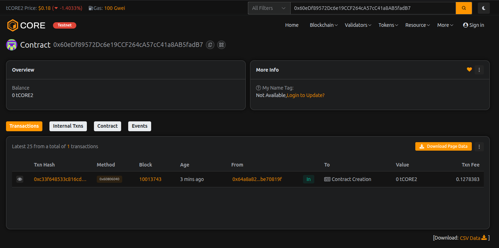

# LiquidLoop Finance

## Project Description

LiquidLoop Finance is a decentralized liquidity pool platform built on the Ethereum blockchain that enables users to provide liquidity and earn automated yield rewards. The platform creates a continuous "loop" of liquidity circulation where providers deposit ETH, earn time-based rewards, and can withdraw their funds at any time while maintaining the pool's stability.

The smart contract implements a transparent and secure mechanism for liquidity management, featuring automated reward calculations, flexible withdrawal options, and adjustable reward rates. LiquidLoop Finance aims to democratize access to DeFi yield generation by providing a simple, user-friendly interface for liquidity provision.

## Project Vision

Our vision is to create a sustainable and efficient decentralized finance ecosystem where:

- **Accessibility**: Anyone can participate in liquidity provision regardless of their technical expertise or capital size
- **Transparency**: All transactions, rewards, and pool metrics are publicly visible on the blockchain
- **Sustainability**: The platform maintains long-term viability through balanced incentive structures
- **Community-Driven**: Governance and decision-making power rests with the community of liquidity providers
- **Innovation**: Continuous improvement and integration of cutting-edge DeFi mechanisms

LiquidLoop Finance strives to bridge the gap between traditional finance and decentralized systems, making passive income generation accessible to everyone while maintaining the security and transparency that blockchain technology provides.

## Key Features

### 1. **Add Liquidity**
- Deposit ETH to become a liquidity provider
- Automatic tracking of deposit time and amounts
- Support for multiple deposits with cumulative rewards

### 2. **Remove Liquidity**
- Withdraw deposited ETH at any time
- Flexible partial or full withdrawal options
- Automatic reward calculation upon withdrawal

### 3. **Claim Rewards**
- Claim earned rewards without removing liquidity
- Time-based reward calculation (annual percentage rate)
- Transparent reward distribution mechanism

### 4. **Calculate Rewards**
- Real-time reward calculation based on deposit amount and time
- Public view function for transparency
- Basis points system for precise reward rates

### 5. **Update Reward Rate**
- Owner-controlled reward rate adjustments
- Flexible response to market conditions
- Safety limits to prevent excessive rates (max 100%)

### Additional Features:
- **Event Logging**: Comprehensive event emission for all major actions
- **Provider Information**: Detailed query functions for user positions
- **Ownership Transfer**: Secure ownership management system
- **Safety Modifiers**: Built-in access control and validation checks

## Future Scope

### Short-term Enhancements (3-6 months)
- **Multi-token Support**: Expand beyond ETH to support ERC-20 tokens
- **Tiered Rewards**: Implement loyalty bonuses for long-term providers
- **Emergency Withdrawal**: Add emergency exit mechanisms with minimal penalties
- **Gas Optimization**: Optimize contract code for lower transaction costs

### Medium-term Development (6-12 months)
- **Governance Token**: Launch native governance token for decentralized decision-making
- **Staking Mechanisms**: Add staking features for additional yield opportunities
- **NFT Integration**: Issue NFTs representing liquidity positions
- **Cross-chain Bridge**: Enable liquidity provision across multiple blockchains
- **Mobile dApp**: Develop mobile applications for iOS and Android

### Long-term Vision (1-3 years)
- **Algorithmic Stability**: Implement AI-driven reward rate optimization
- **Lending Protocol**: Integrate lending and borrowing features
- **Insurance Pool**: Create insurance mechanisms for provider protection
- **DAO Governance**: Full transition to community-driven DAO structure
- **Strategic Partnerships**: Collaborate with major DeFi protocols for enhanced liquidity
- **Institutional Access**: Develop features catering to institutional investors
- **Layer 2 Integration**: Deploy on multiple Layer 2 solutions for scalability

### Research & Innovation
- Zero-knowledge proof integration for enhanced privacy
- Automated market maker (AMM) functionalities
- Dynamic fee structures based on market volatility
- Integration with real-world asset (RWA) tokenization

---

## Technical Specifications

- **Solidity Version**: ^0.8.0
- **License**: MIT
- **Network**: Ethereum (compatible with EVM chains)
- **Primary Token**: ETH

## Getting Started

### Prerequisites
- Node.js (v14 or higher)
- Hardhat or Truffle
- MetaMask or similar Web3 wallet

### Installation
```bash
# Clone the repository
git clone https://github.com/yourusername/LiquidLoopFinance

# Install dependencies
npm install

# Compile contracts
npx hardhat compile

# Run tests
npx hardhat test

# Deploy to local network
npx hardhat run scripts/deploy.js --network localhost
```

## Security Considerations

- Contract has been designed with security best practices
- Recommended to undergo professional audit before mainnet deployment
- Implements standard security patterns: checks-effects-interactions
- Uses OpenZeppelin-style modifiers for access control

## Contributing

We welcome contributions from the community! Please read our contributing guidelines and submit pull requests for any enhancements.

## License

This project is licensed under the MIT License - see the LICENSE file for details.

## Contact

- Website: [Coming Soon]
- Twitter: [@LiquidLoopFinance]
- Discord: [Community Link]
- Email: contact@liquidloop.finance

---

**Disclaimer**: This is experimental DeFi software. Use at your own risk. Always do your own research before interacting with smart contracts.

---

## Contract Details:

Transaction id: 0x60eDf89572Dc6e19CCF264cA57cC41a8AB5fadB7
